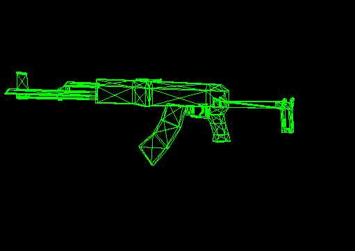
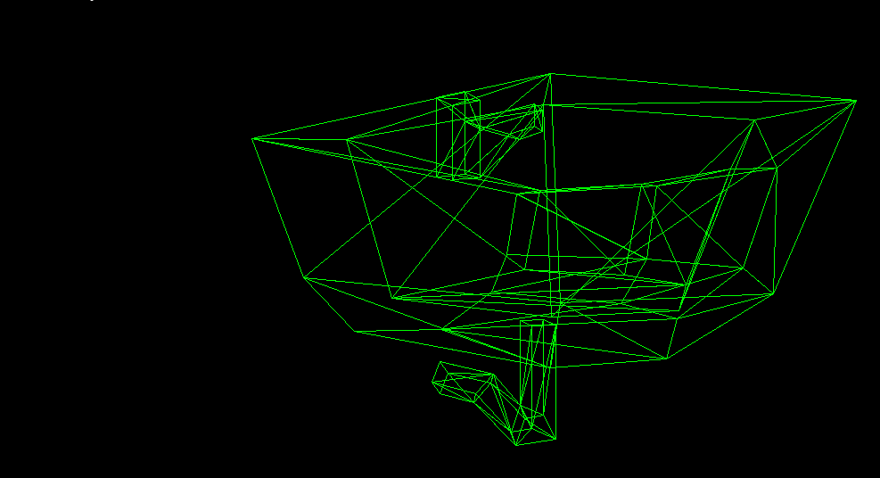

# WIREFRAME DEMO

<p align="center">
    
</p>
<p align="center">
    
</p>
<p align="center">
    
</p>

---
## BUILDNING & RUNNING
To build the project:
```bash
cd wireframe-renderer/
make
```
To run the project:
```bash
make run
```

## SOURCES

[YouTube](https://www.youtube.com/watch?v=qjWkNZ0SXfo)
